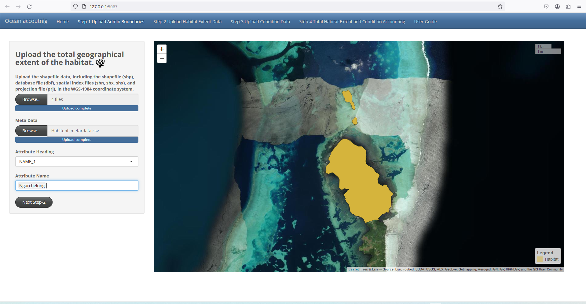

# <h1 style="text-align:center;">SEEA-Habitat Extent and Conditions Accounting-Tool</h1>

Acknowledgement: For more information on the Ocean Extent and condition accounting tool please contact Aahlaad Musunuru.
 
Email: aahlaadmusunuru1995@gmail.com

<!-- vscode-markdown-toc -->
- [SEEA-Habitat Extent and Conditions Accounting-Tool](#seea-habitat-extent-and-conditions-accounting-tool)
  - [Background](#background)
  - [Overall Procedure:](#overall-procedure)
    - [Step-1 Data Collection:](#step-1-data-collection)
      - [Step-1.1-Data Mangroves Data:](#step-11-data-mangroves-data)
      - [1.1.1 Downloading the Palau Admin boundaries:](#111-downloading-the-palau-admin-boundaries)
      - [1.1.2 Download Mangroves Condition indicators data:](#112-download-mangroves-condition-indicators-data)
    - [Step-2:– Data Pre-Processing](#step-2-data-pre-processing)
      - [ 2.1.1: Add Admin Boundaries Data into QGIS](#-211-add-admin-boundaries-data-into-qgis)
      - [2.1.2: Filter the admin boundaries data](#212-filter-the-admin-boundaries-data)
      - [2.1.3: Add Mangroves Data](#213-add-mangroves-data)
      - [2.1.4: Clip Mangroves Data](#214-clip-mangroves-data)
      - [2.1.5: Merge mangroves and admin layers.](#215-merge-mangroves-and-admin-layers)
      - [2.1.6: Convert Raster to Vector](#216-convert-raster-to-vector)
      - [2.1.7: Load all the Condition.](#217-load-all-the-condition)
      - [2.1.8: Clip the rasters to the condition Indicators.](#218-clip-the-rasters-to-the-condition-indicators)
    - [Step-3: Generating Habitat Extent and Condition Accounts Using R-Shiny (Ocean Extent And Condition Accounting):](#step-3-generating-habitat-extent-and-condition-accounts-using-r-shiny-ocean-extent-and-condition-accounting)
      - [Step-3.1.1 Step-1: R-Shiny (Ocean Extent And Condition Accounting)](#step-311-step-1-r-shiny-ocean-extent-and-condition-accounting)
      - [Step-3.1.2 R-Shiny Step-1 Upload Admin Boundaries(Ocean Extent And Condition Accounting)](#step-312-r-shiny-step-1-upload-admin-boundariesocean-extent-and-condition-accounting)
      - [Step-3.1.3: R-Shiny Step-2 Upload Habitat Extent Data:](#step-313-r-shiny-step-2-upload-habitat-extent-data)
      - [Step-3.1.4: Inputs (Step-3 Upload Condition Data):](#step-314-inputs-step-3-upload-condition-data)
      - [Step-3.1.5: Inputs (Step-4 Total Habitat Extent and Condition Accounting):](#step-315-inputs-step-4-total-habitat-extent-and-condition-accounting)
  - [Appendix](#appendix)
    - [QGIS](#qgis)
    - [Downloading and Installing QGIS](#downloading-and-installing-qgis)
    - [Open QGIS](#open-qgis)
  

<!-- vscode-markdown-toc-config
	numbering=true
	autoSave=true
	/vscode-markdown-toc-config -->
<!-- /vscode-markdown-toc -->

## Background
In this study, we have developed a tool using the R-Shiny application to support various stakeholders, including National Statistics Officers (NSOs), the Mangrove and Coral Reef Monitoring Center, the Ministry of Environment, Forest and Climate Change, as well as various non-profit organizations such as UNEP, UNDP, FAO, and others. The purpose of this tool is to monitor the extent and condition of habitats, and to generate SEEA (System of Environmental-Economic Accounts) extent and condition accounts tables and maps. Users are required to develop accounts by utilizing geo spatial data and reference statistical indicators. Prior to uploading the data as input to the R-Shiny application, the geo spatial datasets need to be preprocessed and prepared. Once the data is uploaded, users can generate various maps, accounting tables, and statistical reports. 

## Overall Procedure:

The overall process is to develop several SEEA accounts is
distinguished in to 3 different types which includes Data collection , Data preprocessing and generating accounts In this study, we explain the process of producing habitat extent and condition accounts. We have chosen Palau's Ngarchelong island as a case study to develop various types of accounts.  

 

Figure 1 : Overall Procedure

### Step-1 Data Collection:
In Data Collection and preprocessing stage we are going to download and pre process the mangroves extent and condition indicators to the Ngarchelong admin boundaries. 

#### Step-1.1-Data Mangroves Data: 

* In this study we can download the Global Mangrove Watch data from https://data.unep-wcmc.org/datasets/45.  The data has been downloaded for two time periods 2007 and in 2016. 
  

Figure 2 : Download mangroves data

* Once we have downloaded the data, we need to extract the global mangroves data for two time periods for year 2007 and 2016.
* Unzip the global mangroves data.

Figure 3 : Unzip mangroves data

#### 1.1.1 Downloading the Palau Admin boundaries:
* Download the Palau admin boundaries data from DIVA-GIS  (https://www.diva-gis.org/gdata) or any other source in a shape file formate. Once the data has been downloading the user can start preprocessing .*

Figure 4 :  Downloading the Palau Admin boundaries:

####  1.1.2 Download Mangroves Condition indicators data:
Download Mangroves Condition indicators like Biomass, and Canopy Height from ORNL DAAC https://daac.ornl.gov/cgi-bin/dsviewer.pl?ds_id=1665. To do this we first need to log in to the portal. Specifying the country name download the condition indicator namely Aboveground mangrove biomass, Mangrove basalarea weighted height and Mangrove canopy maximum height indicators for this use case we have download this three condition indicators Mangrove_agb_Palau, Mangrove_hba95_Palau and Mangrove_hmax95_Palau.

Figure 5 : Download  mangroves Biomas data

###  Step-2:– Data Pre-Processing 

After downloading the data, the next action is data pre-processing using QGIS. QGIS is an opensource geographic information system application that supports viewing, editing and analysis of geospatial data.More information on how to download and install and use QGIS is provided in the Appendix to
this guide.

####    2.1.1: Add Admin Boundaries Data into QGIS

For this exercise, we created a new folder and named it “Data Pre-Processing”. We encourage the user to do the same or choose a folder name and location that is convenient. 

Open QGIS Desktop with GRASS, and do the following:

*  Click on Layer
*  Go to “Add Layer”
*  Select “Add Vector Layer” as shown in the picture below

Figure 6 : Select Admin Boundaries layer

*  Next, Click the Browse button and select the file PLW_adm1.shp  in .shp file format
*  Click OpenP
* Click “Add” and close the window.

Figure 7 : Add Admin boundata PLW adm1

####  2.1.2: Filter the admin boundaries data 

* Click on Select Feature By area button on top  
* Now select the  "Ngarchelong" region to filter the data. 

Figure 8: Open the attribute table

* Filter the Ngarchelong region from the PLW_adm1
* Now right click on the PLW_adm1 and click on Export and select Save Selected Features As...

Figure 9: Export the Ngarchelong from PLW_adm1.

* Export the Ngarchelong region as a shape-file to QGIS.
  

Figure 10: Export the Ngarchelong admin extent.

* Ok 

####  2.1.3: Add Mangroves Data 
*  Click on Add Layer 
*  Select add vector layer 
* Add global mangroves gmw_v3_2007_vec.shp  and  gmw_v3_2016_vec.shp   

Figure 11: Add Vector layer

* Click on Add.
  
####   2.1.4: Clip Mangroves Data 

* In the processing tool box search for Clip vector by extent  
*  In the Input layer select gmw_v3_2007_vec 
*  In the Clipping extent select  Ngarchelong 
*  Click on select button and go to   Save to file
*  Save the file as gmw_v3_2007_Ngarchelong
*   Click on  Run

Figure 12: Clip the Global mangroves data

* Repeat the steps to clip the vector layer for  gmw_v3_2016_vec.shp  and save as  gmw_v3_2016_Ngarchelong.shp 
  

#### 2.1.5: Merge mangroves and admin layers.

*  Now right click and remove all other layers except   Ngarchelong,     gmw_v3_2007_Ngarchelong, and gmw_v3_2016_Ngarchelong 

* In the input layers select gmw_v3_2007_Ngarchelong and Ngarchelong  
* In the distribution we need to select on  the  projection  .
* Finally save the layer as  Year_2007_Ngarchelong_Mangroves_Non_Mangroves
* Repeat the same steps and create a new merge layer and name as Year_2016_Ngarchelong_Mangroves_Non_Mangroves

* finally click on run to save the result.
  
 

Figure 13: Merge Vector Layer

* Right click on the Year_2007_Ngarchelong_Mangroves_Non_Mangroves Click on Open Attribute Table

* Click on the  on top of the attribute table. 
* Next in the PXLVAL field replace Null value with "2".
* In the fid replace "Null" value with the 0.
* click on save edit button  finally stop the editing. 
* Click on close button to close the attribute table.
    
 

 Figure 14: Open Attribute Table

#### 2.1.6: Convert Raster to Vector

* To do this first click on Raster and select on conversion in which we need to convert from vector to raster.
* Input layer defeine  Year_2007_Ngarchelong_Mangroves_Non_Mangroves
* Field to use for a burn in value PXlVAL
* Output raster size unitsGeoreferenced_units
* Width/Horizontal resolution define  0.000300
* Height/Vertical  resolution define  0.000300
Output extent define as Year_2007_Ngarchelong_Mangroves_Non_Mangroves

* If we go down click on brows button and we can see rasterized and select on save to file save the raster image as Year_2007_Ngarchelong_Mangroves_Non_Mangroves
  
* Click on Run
* Repeat the same steps for the Year_2016_Ngarchelong_Mangroves_Non_Mangroves

<!--  Continue From hear a -->

 

Figure 15: Convert Raster to Vector

* Right click and remove all the layers except  Year_2007_Ngarchelong_Mangroves_Non_Mangroves,Year_2016_Ngarchelong_Mangroves_Non_Mangroves raster files more over the Ngarchelong layer.
   
#### 2.1.7: Load all the Condition.

* Now click on Layers
* Next Select Add raser Layers 
* Add all the condition raster layers in to QGIS Mangrove_agb_Palau,Mangrove_hmax95_Palau and Mangrove_hba95_Palau
   

Figure 16: Load the Condition Raster

#### 2.1.8: Clip the rasters to the condition Indicators.

* First click in raster and go to the  Extraction.
*  Next Click on Clip raster by mask layer
* In the input layer  define Mangrove_agb_Palau
* In the masking layer define  Ngarchelong
*  Define the   Projection
* Click on  Run  
* Clip the raster for all three layers Mangrove_agb_Palau, Mangrove_hmax95_Palau and   Mangrove_hba95_Palau

Figure 17: Clip Condition Indicators Raster

_ _By this the total Data Processing is been completed._  

###  Step-3: Generating Habitat Extent and Condition Accounts Using R-Shiny (Ocean Extent And Condition Accounting):

To generate Habitat extent and Condition Accounts in this study we have used R-Shiny application. Where any user can download different Accounts in different stages. Overall the tool is divided in to 4 different groups which are 
* Step-1 Upload Admin Boundaries, 
* Step-2 Upload Habitat Extent Data, 
* Step-3 Upload Condition Data 
* Step-4 Total Habitat Extent and Condition Accounting.
  
To Produce Habitat Extent and Condition Accounts in each stage different inputs data sets are need to be prepared. User need to provide both raster data and vector data in different stages fallowed with that they also need to provide some ".csv". When the user comes to final step, they can download overall Habitat change accounting report.

* The above data collection and pre processing stages can be skipped if the users have download the sample data.
  
* The data collection and pre processing steps above proved the process how to prepare the spacial data inputs to produce habitat extent and condition accounts.
  
* Users can click on "INSTRUCTIONAL VIDEO" to see how  the  Ocean extent and condition accounting tool works. 
  
* The below steps provide more elaborative way how to use the Ocean Extent And Condition Accounting tool.
  
#### Step-3.1.1 Step-1: R-Shiny (Ocean Extent And Condition Accounting)
* Click on this url to access this R-shiny tool. (https://aahlaad-musunuru.shinyapps.io/SEEA_Ocean_Accounting/)
* First the user need to click on "Get Started Now" Button.
* It will redirect to a  "Step-1 Upload Admin Boundaries"
 window. 
  

Figure 18: Get-Started

#### Step-3.1.2 R-Shiny Step-1 Upload Admin Boundaries(Ocean Extent And Condition Accounting)

* In this step first the users need to upload the admin boundaries data which is in shape file formate. In this study we are using 'Ngarchelong.shp'.

* They need to include all other files .shp,.dbf,.sbn,.sbx,.shx,.prj as well.

* Next the user need to click on Meta Data file and upload   'Habitent_metardata.csv'.
* The below table gives the example of the 'Habitat Meta Data file'.

  
| Data Type                            | Satellite                                | Projection | Resolution | Format | Data Source                                                           |
|--------------------------------------|------------------------------------------|------------|------------|--------|-----------------------------------------------------------------------|
| Mangroves                            | JERS-1, ALOS PALSAR, ALOS-2 PALSAR-2      | WGS 1984   | 30 m       | SHP    | [UNEP-WCMC](https://data.unep-wcmc.org/datasets/45)                  |
| World Database on Protected Areas    |                                          | WGS 1984   |            | SHP    | [IUCN - World Database](https://www.iucn.org/theme/protected-areas/our-work/world-database-protected-areas) |

   Table 1: Metadata Table.

* From then two new dropdown we can see  Attribute Heading 
user need to select specific attribute Heading to filter the admin boundaries.In this study we are selecting
Island .

* From hear the user will be able to select the
Attribute Name in our case the attribute name is Ngarchelong.

* When the user click on the Ngarchelong on the Attribute name they will able to see the Ngarchelong admin boundaries map.
  
* Next click on Next Step-2.
  

Figure 19: Ngarchelong admin boundaries map

#### Step-3.1.3: R-Shiny Step-2 Upload Habitat Extent Data:
In this step in the side bar panel user need to update several parameters.

* In this step users need to provide opening extent raster data in this study we are providing clipped mangrove non mangroves raster data of "Year2007.tif" 

* In the next step users need to provide closing extent raster data in this study we are providing clipped mangrove non mangroves raster data of "Year2016.tif" 

Figure 20: Upload habitat opening extent closing  extent data and parameters

* Next the user need to upload the 'Habitant.csv'  file.

*  The column names are defined as ID,Classes and Colors. 
*  The ID which represents the Pixel ID of the raster. 
*  Next the user need to provide the habitat classes which gives the information about the habitat names.
*  More on we can see the habitat colors.
*  This file need to saved as a Habitant.csv file formate.

  | ID | Habitat       | Colors   |
  |----|---------------|----------|
  | 1  | Mangroves     | #064635  |
  | 2  | Non Mangroves | #F7F7F7  |

Table 2: Habitant Classifications.

* Finally they need to upload the time period data 'Years_Data.csv'  file.
    | Years  |
    |--------|
    | Year 2007 |
    | Year 2017 |

Table 3: Time Period.

* First In the main panel the user need to click on the run button  in the opening extent map.
* Mangrove opening extent  map will appear on the display.
* User need to click on 
 download button on the right to download the opening extent accounting report.
* Next the user need to go and click on "Opening Extent Statistics"  panel if they want to see the statices  tables.

* Finally they need to click on
 download button to download the statices table.

Figure 21: Opening Extent Maps and Statics  

* In the main panel the user need to click on the run button  in in the closing extent map.
* Mangrove closing extent  map will appear on the display.
* User need to click on 
 download button on the right to download the closing extent accounting report.
* Next the user need to go and click on "closing Extent Statistics"  panel if they want to see the statices  tables.

* Finally they need to click on
 download button to download the statices table.

Figure 22:Closing Extent Maps and Statics  

* Now the user need to go to the "Habitat transformation hot spot maps" window. 
  

* First In the main panel the user need to click on the run button  user will able to see  the Habitats transformation hot spot maps.

* On the left side the user need to change the dropdown window to change"Habitat transformation hot spot maps".

* User need to click on 
 download button on the right to download the Habitat transformation hot spot and report.

* Similar to this the users can download the 
 "Habitat transformation markers marks maps".

* Users need to click on the change statistics panel and they can download  the habitat change accounting tables and reports.
  

Figure 23: Change Statics  

* By the end of the section the users will be able to download different opening and closing statistics.
   
  - a) Opening Extent Html report.
  - b) Opening Extent Statistics which shows the Area.ha and percentage of habitat.
  - c) Closing Extent Html report.
  - d) Closing Extent Statistics which shows the Area.ha and percentage of habitat.
     

* Users can download the habitat change statistics and habitat transformation maps.
  - a) Ecosystem asset accounting tables.
  - b) Habitat Transition Change Matrix.
  - c) Habitat Percentage Change Table.
  - d) Habitat Transformation Table.
  - e) Habitat transformation hot spot maps report.
  - f) Habitat transformation markers maps report.

#### Step-3.1.4: Inputs (Step-3 Upload Condition Data):

 * In this step the users need to upload the inputs files of opening and closing time periods in raster file format in to the side bar panel. 

Figure 24: Condition Accounting Side bar panel.

* In the first step the user need to upload the condition indicators for opening time period.
   
   * Mangrove_agb_Palau.tif
   * Mangrove_hba95_Palau.tif 
   * Mangrove_hmax95_Palau.tif
  
* Fallowed by this they need to upload the condition indicator parameters table in opening time periods.ecosystem_condition_opening.csv  
  

| Condition Indicator               | Time Interval | Measurement Unit |
|-----------------------------------|---------------|------------------|
| Aboveground mangrove biomass      | 2010          | Mg ha-1         |
| Mangrove basal area weighted height| 2010          | meters         |
| Mangrove canopy maximum height    | 2010          | meters          |

   Table 2: Ecosystem Condition Opening Accounting table.

* Next if the user intrusted they need to change the color ramp.
  
* Similar to the opening time period user ned to upload the condition indicators for closing time period. 
  
* In this case we are uploading same parameters for the closing time periods due to lack of available data in closing time periods.
  
    * Mangrove_agb_Palau.tif
    * Mangrove_hba95_Palau.tif 
    * Mangrove_hmax95_Palau.tif

* Fallowed by this they need to upload the condition indicator parameters table in Closing time periods.ecosystem_condition_closing.csv  
  
| Condition Indicator               | Time Interval | Measurement Unit |
|-----------------------------------|---------------|------------------|
| Aboveground mangrove biomass      | 2010          | Mg ha-1         |
| Mangrove basal area weighted height| 2010          | meters         |
| Mangrove canopy maximum height    | 2010          | meters          |

   Table 3: Ecosystem Condition Closing Accounting table.

* In the main panel in opening condition accounting user need to click on  run  button to generate opening extent map and statistics and generate opening accounting report.
  
* User can chang the drop downs on the maps to see different condition indicators.

* Next the user can download the accounting report by clicking on download button on right .
  
* In the Opening Statistics user can download different accounting tables.
  

Figure 25: Conation Opening Extent panel

* In the main panel in closing condition accounting user need to click on  run  button to generate closing extent map and statistics and generate closing and condition change accounting report.

*  Next the user will be able to see the different condition indicators on top left.
*  In the closing Statistics user can  closing statistics table.
*  Next in the condition change statistics table user can download condition change statistics table and accounting report. 

  Figure 26: Conation Closing Extent panel

* By the end of the this section the user will be able to produce the habitat condition accenting and reports as show bellow. 
  
- a) Condition Opening statices (Min, Mean, Max and SD) table.
- b) Condition Opening statices report.
- c) Condition Closing statices (Min, Mean, Max and SD) table.
- d) Condition Change Accounting statices table.csv.
- e) Condition Change statices report.html.
- f) Condition Change Accounting report.html.

#### Step-3.1.5: Inputs (Step-4 Total Habitat Extent and Condition Accounting):

* In this step the user will able to see and download the total Habitat extent and condition Accounting statistics.

Figure 27: Input panel for total habitat Extent and Condition Accounting window.

* Users need to upload the "References_Habitats.csv" file table to generate habitat change statics.

| Statistics | Condition                          | Habitat       | Reference Level/Target |
|------------|------------------------------------|---------------|------------------------|
| Min        | Aboveground mangrove biomass       | Mangroves     |                        |
| Mean       | Aboveground mangrove biomass       | Mangroves     |                        |
| Max        | Aboveground mangrove biomass       | Mangroves     |                        |
| SD         | Aboveground mangrove biomass       | Mangroves     |                        |
| Min        | Mangrove basal area weighted height| Mangroves     |                        |
| Mean       | Mangrove basal area weighted height| Mangroves     |                        |
| Max        | Mangrove basal area weighted height| Mangroves     |                        |
| SD         | Mangrove basal area weighted height| Mangroves     |                        |
| Min        | Mangrove canopy maximum height      | Mangroves     |                        |
| Mean       | Mangrove canopy maximum height      | Mangroves     |                        |
| Max        | Mangrove canopy maximum height      | Mangroves     |                        |
| SD         | Mangrove canopy maximum height      | Mangroves     |                        |
| Min        | Aboveground mangrove biomass       | Non Mangroves |                        |
| Mean       | Aboveground mangrove biomass       | Non Mangroves |                        |
| Max        | Aboveground mangrove biomass       | Non Mangroves |                        |
| SD         | Aboveground mangrove biomass       | Non Mangroves |                        |
| Min        | Mangrove basal area weighted height| Non Mangroves |                        |
| Mean       | Mangrove basal area weighted height| Non Mangroves |                        |
| Max        | Mangrove basal area weighted height| Non Mangroves |                        |
| SD         | Mangrove basal area weighted height| Non Mangroves |                        |
| Min        | Mangrove canopy maximum height      | Non Mangroves |                        |
| Mean       | Mangrove canopy maximum height      | Non Mangroves |                        |
| Max        | Mangrove canopy maximum height      | Non Mangroves |                        |
| SD         | Mangrove canopy maximum height      | Non Mangroves |                        |

Table 4: References Habitats.

* The will also able to see the data integrated accounting habitat transformation markers maps.
* On the right side of the map users can download the "Habitat transformation markers map" report.

  
  
Figure 28: Habitat Transformation markers map

   

* Next the user can download the "Habitat Opening"  statistics and report in Habitat Opening tab. Where the user will get the Min,Mean,Max and SD for the Habitat condition. For the Opening year fallowed by this the user can download the Habitat_opening_accounting_report.
  

Figure 29: Habitat Condition Statistics

*  Next the user can download the  "Habitat Closing"     statistics and report in Habitat Closing tab. Where the user will get the Min,Mean,Max and SD for the Habitat condition for the Closing year fallowed by this the user can download the Habitat_Closing accounting report in the closing time period.

Figure 30: Habitat Condition Closing Statistics

 

* In the  "Habitat Condition Change Statistics"   table users can download the Habitat Condition Change Statistics as a excel work book more over they can download the 
habitat Extent Condition Change accounting report as a html file. To understand the condition of the habitats in two time frames.

* Fallowed by this the "Reference Level/Target" helps the users to get the reference  number to monitor how much the condition of the habitat is been varied from the specif reference point.  

  

Figure 31: Habitat Condition Change Statistics

  

* In the final section the users  will be able to download different types of accounting reports maps and tables.
  
- a) Habitat condition accounting table opening:
- b) Habitat condition accounting opening report:
- c) Habitat condition accounting table closing:
- d) Habitat condition accounting closing report:
- e) Habitat condition accounting table change:
- f)  Total Habitat extent and condition accounting report .html file.

## Appendix
The Appendix gives a brief overview of QGIS, which is the open-source programs used in the exercise outlined in this guide and shows how to download and install these programs for use.

### QGIS
QGIS is a cross-platform desktop geographic information system that supports viewing, editing and analysis of geo-spatial data. 
We used the most recent version of QGIS available, and we advise that you do the same. 

* GRASS – Geographic Resource Analysis Support System
* SAGA – System of Automated Geoscientific Analysis
* GDAL – Geographic Data Abstraction Library
  
### Downloading and Installing QGIS

1. Go to the QGIS website (https://qgis.org/en/site/forusers/download.html)
2. Download the resent version.

  

3. We have used the resent version to download and install Qgis. 
   
  

4. Click on Next button to start installing QGIS.
   
  

6. Click on I Agree for license agreement as seen below:
   
 

7. Click on Next in Choose Install Location, as seen in picture below: 
   
    

8. At the end click on install button to install the QGIS.
   
     

  
### Open QGIS 

* Now Open the Installed QGIS  and Click on New Empty project to start.
   
 

